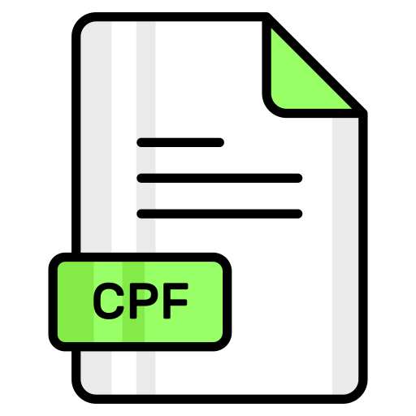

#  CPF Hero - Gerador e Validador de CPF 🚀


Um site simples e eficiente para **gerar** e **validar** números de CPF (Cadastro de Pessoa Física) . Desenvolvido com HTML, CSS e TypeScript, com objetivo de  práticar e releembrar conhecimentos adquiridos.


---

## 📌 Funcionalidades

- ✅ Verifica se um CPF digitado é válido
- 🔁 Gera CPFs válidos aleatórios
- 📋 Copia o CPF para a área de transferência
- 🎯 Máscara de input para facilitar a digitação (`IMask.js`) 
- ⚡ Interface leve e responsiva

---

## 🗂 Estrutura de Pastas
```
CPF-HERO/
├── dist/
│ └── utils/
│ ├── geraCpf.js
│ ├── validaCpf.js
│ └── index.js
├── src/
│ └── utils/
│ ├── geraCpf.ts
│ ├── validaCpf.ts
│ └── index.ts
├── styles/
│ └── style.css
├── cpfverde.png
├── index.html
├── README.md
└── tsconfig.json
```

---

## 🧪 Tecnologias Utilizadas

- HTML5
- CSS3 (modularizado)
- TypeScript
- JavaScript (transpilado)
- [IMask.js](https://imask.js.org/) – para máscara de input

---

## 🚀 Como Usar

1. **Clone o repositório:**

```
git clone https://github.com/seu-usuario/CPF-Hero.git
cd CPF-Hero
```

2. **Compile o TypeScript:**

Se você ainda não tem o TypeScript instalado:
```
npm install -g typescript

```
Depois:
```
tsc
```

3. **Abra o arquivo HTML:**
```
public/index.html
```

Você pode simplesmente abrir o HTML no navegador, sem servidor local.**
